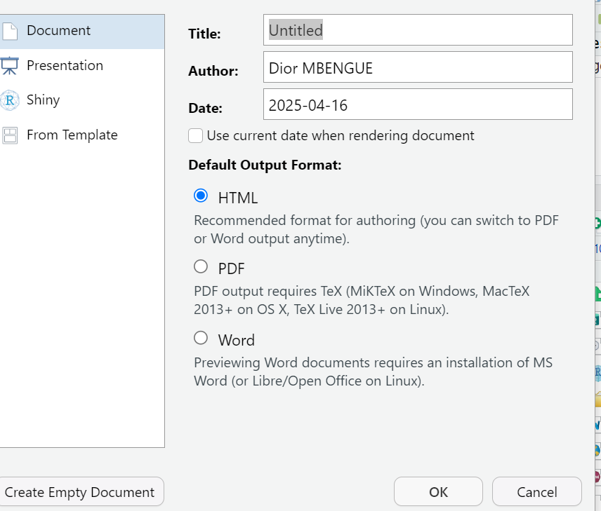
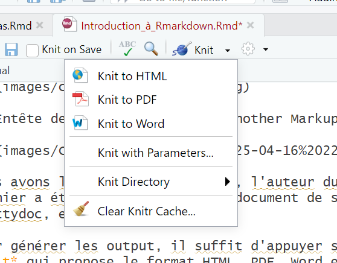
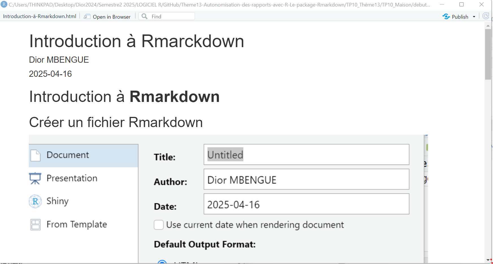
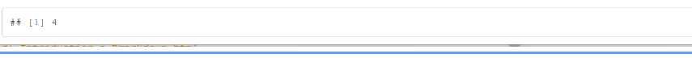
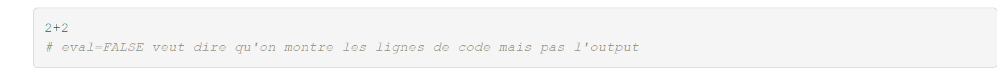
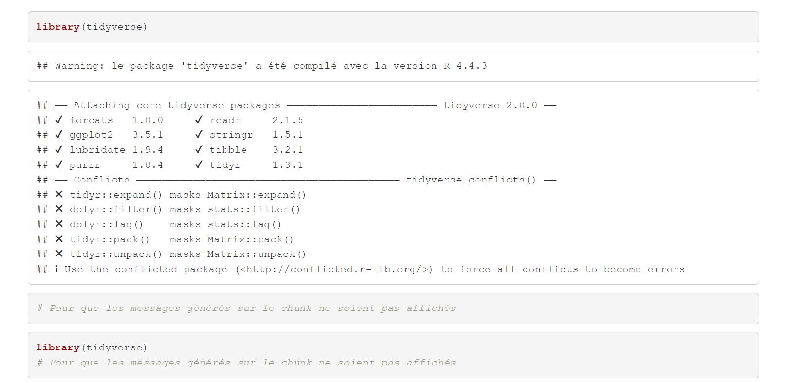
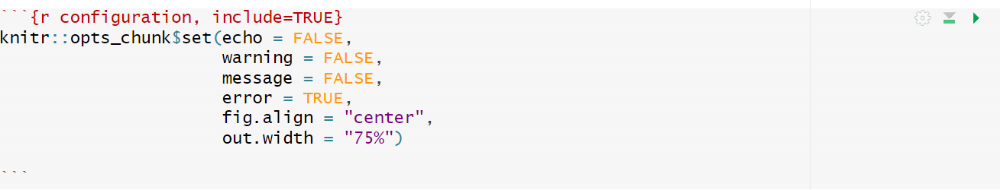
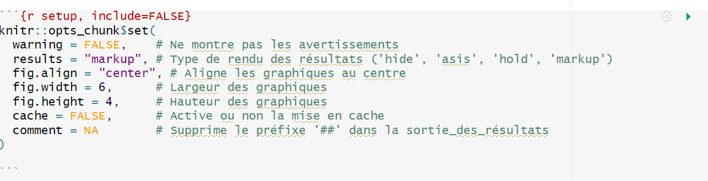
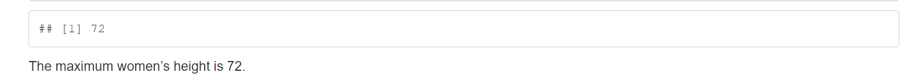
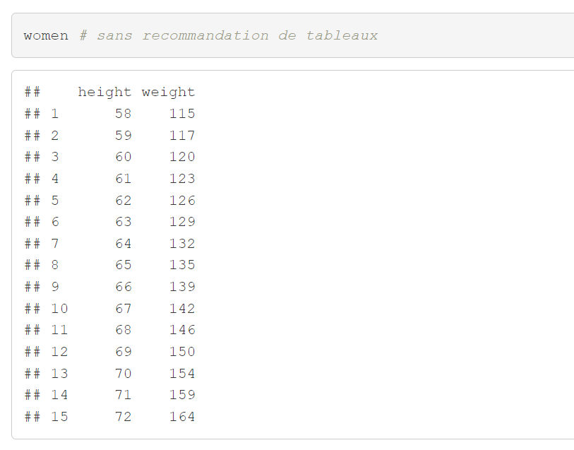

---
output:
  pdf_document:
    latex_engine: xelatex
    keep_tex: true
  html_document:
    df_print: paged
  word_document: default
  toc: true
header-includes:
- \usepackage{hyperref}
- \usepackage{amsmath}
- \usepackage{amssymb}
- \usepackage{graphicx}
- \usepackage{fontspec}
- \usepackage{xcolor}
- \usepackage{tikz}
- \definecolor{blue}{RGB}{0, 0, 100}
- \setmainfont{Times New Roman}
- \setsansfont{Times New Roman}
- \setmonofont{Courier New}
- \usepackage[margin=1in]{geometry}
- \usepackage{titlesec}
- \titleformat{\section}{\Huge\bfseries\color{blue}}{\thesection}{1em}{}
- \titleformat{\subsection}{\huge\bfseries\color{blue}}{\thesubsection}{1em}{}
- \titleformat{\subsubsection}{\LARGE\bfseries\color{blue}}{\thesubsubsection}{1em}{}
- \usepackage{tocloft}
- \renewcommand{\cftsecfont}{\small}
- \renewcommand{\cftsubsecfont}{\footnotesize}
- \renewcommand{\cftsecpagefont}{\small}
- \renewcommand{\cftsubsecpagefont}{\footnotesize}
- \renewcommand{\cftsecleader}{\cftdotfill{\cftdotsep}}
---

\begin{titlepage}
    \begin{center}
    % Début de la bordure avec TikZ
    \begin{tikzpicture}[remember picture, overlay] % overlay = force TikZ à dessiner par-dessus le contenu existant de la page, plutôt que de réserver un espace supplémentaire pour le dessin, remember = lorsque vous voulez dessiner par rapport à la position exacte de la page
    % Définir une couleur élégante
    \definecolor{blue}{RGB}{0, 100, 0}
    
    % Dessiner une bordure élégante avec coins arrondis
    \draw[
        line width=5pt, % Épaisseur du trait
        black, % Couleur de la bordure
        rounded corners=15pt, % Coins arrondis
        double, % Bordure double
        double distance=2pt % Espacement entre les deux lignes
    ] 
        ([xshift=10pt, yshift=-10pt]current page.north west) rectangle
        ([xshift=-10pt, yshift=10pt]current page.south east);
    \end{tikzpicture}
        \includegraphics[width=7cm]{Figures/LOGO1.jpeg} \\[0.1cm]
        \includegraphics[width=6cm]{Figures/LOGO2.jpeg} \\[0.1cm]
        
        \textbf{\large Agence nationale de la Statistique et de la Démographie (ANSD)}\\[0.2cm]
        
        \includegraphics[width=4cm]{Figures/LOGO3.jpeg} \\[0.1cm]
        
        \textbf{\large Ecole nationale de la Statistique et de l'Analyse économique Pierre Ndiaye (ENSAE)}\\[0.4cm]
        
        \textit{\LARGE Semestre 2 : Projet statistique sous R }\\[0.3cm]
        \textbf{\Huge \color{blue} \textsf{Partie 1 : Introduction à Rmarkdown}}\\[0.2cm]
        
        \begin{minipage}{0.5\textwidth}
    \begin{flushleft} \large
        \emph{\textsf{Rédigé par :}}\\
        \textbf{Khadidiatou Diakhaté}\\
        \textbf{Haba Fromo Francis}\\
        \textbf{Dior Mbengue}\\
    \end{flushleft}
\end{minipage}
        \hfill
        \begin{minipage}{0.4\textwidth}
            \begin{flushright} \large
                \emph{\textsf{Sous la supervision de :}} \\
                \textbf{M. Aboubacre HEMA}\\
                \textit{Research Analyst }
            \end{flushright}
        \end{minipage}

        \vfill 

        {\large \textsf{Année scolaire : 2024/2025}}\\[0.5cm]
        
    \end{center}
\end{titlepage}

# Créer un fichier Rmarkdown

{width="511"}

# Entête de Rmarkdown YAML(Yet Another Markup Language)

{width="412"}

Nous avons le titre du document R, l'auteur du document, la date où le fichier a été créé et le type du document de sortie( Word, PPT, PDF, Prettydoc, etc).

Pour générer les output, il suffit d'appuyer sur *knit on save* ou sur *knit* qui propose le format HTML, PDF, Word et d'autres options.

{width="428"}

**OUTPUT Word**

{width="441"}

**OUTPUT HTML**

{width="441"}

**OUTPUT PDF**

{width="465"}

Pour avoir la sortie PDF, il faut installer LateX ou MicteX

Nous avons aussi l'output **Prettydoc**

# Les chunk options et les global options

## chunk de configuration

Il est préférable de configurer le comportement par défaut Knitr pour faire certains réglages comme la position et la taille des figures ou l'affichage des lignes de codes(instructions sur R) ou non dans le document de sortie. Ce chunk de configuration utilise cette fonction pour définir les options par défaut applicables à tous les chunk en dessous.

```{r setup, include=TRUE}
knitr::opts_chunk$set()
```

Aprés ce chunk, il est recommandé de faire un autre chunk pour charger les packages et un autre pour charger les données qui seront utilisés tout au long.

```{r eval=FALSE}
#vérifier et installer les packages nécessaires
packages <- c("haven", "utils", "dplyr", "gtsummary", "survey","labelled","compareDF")
for (pkg in packages) {
  if (!require(pkg, character.only = TRUE)) install.packages(pkg, dependencies = TRUE)
  library(pkg, character.only = TRUE)
}
```

Dans la mesure du possible, il est préférable d’utiliser des chemins relatifs pour les fichiers (exemple : ./donnees/mesdonnees.csv), plutôt que des chemins absolus (exemple : D:/chemin/vers/les/donnees/mesdonnees.csv).

Il peut arriver qu’il soit difficile d’accéder à des fichiers en utilisant uniquement des chemins relatifs. Une solution de repli consiste à définir le chemin absolu du dossier à un seul endroit dans le code source du rapport, puis à l’utiliser de façon relative dans les fonctions d’importation. Voici un exemple :

```{r donnees, eval=FALSE}
# Définir UNE SEULE FOIS le répertoire des données
dossier_donnees <- "D:/chemin/vers/les/donnees/"
# Charger les données avec un chemin composé
donnees1 <- fread(paste0(dossier_donnees, "mesdonnees1.csv"))
donnees2 <- fread(paste0(dossier_donnees, "mesdonnees2.csv"))
```

On peut aussi nommer un chunk

```{r nom_du_chunk, eval=FALSE}
resultat <- 1 + 1
print(resultat)
```


```{r, echo=FALSE}
2+2
# echo=FALSE veut dire qu'on montre l'output seulement(pas les lignes de code)

```



```{r, eval=FALSE}
2+2
# eval=FALSE veut dire qu'on montre les lignes de code mais pas l'output
```



```{r, include=FALSE}
2+2
#include=FALSE veut dire on n'aura ni output ni les lignes de code 
```

```{r message=TRUE}
library(tidyverse)
# Pour que les messages générés sur le chunk ne soient pas affichés
```

```{r message=FALSE}
library(tidyverse)
# Pour que les messages générés sur le chunk ne soient pas affichés
```

{width="472"}



Dans cet exemple, il est demandé à R Markdown de ne pas inclure les instructions R dans le document de sortie (echo = FALSE). Les warnings et les messages d’informations n’apparaîtront pas non plus dans le fichier de sortie. En revanche, les erreurs apparaîtront (error = TRUE). Les figures sont centrées (fig.align = "center") et ont une largeur de 75% de la largeur du texte (out.width = "75%").

Nous avons encore



# Insertion d'éléments et de bullet

-   Pour insérer une image sur Rmarkdown, on peut mettre un code du type " ou juste copier l'image dans la partie **Visual**

-   Pour insérer un lien:[(<https://thegraph.org>)]

# Inline Code

Les inlines codes dans Rmarkdown permettent d'insérer directement des résultats à l'intérieur du texte. Il sont utiles pour rendre le rapport dynamique.

```{r}
max(women$height)
```

The maximum women's height is `r max(women$height)`.



# Les tableaux

```{r}
women # sans recommandation de tableaux
```



```{r}
# Afficher des tableaux à partir des données de R
pacman::p_load(flextable, gt, reactable)
flextable::flextable(women)
# gt::gt(women)
# reactable::reactable(women)
```

Un autre exemple

```{r}
head(iris)
# cela affichera les premiéres lignes de iris
```

```{r}
knitr::kable(head(iris), caption = "Premières lignes du jeu de_données_iris")
# On peut améliorer les tableaux avec cette variable
```

```{r, results='asis'}
library(kableExtra)
knitr::kable(head(iris), caption = "Iris avec kableExtra")
```

```{r eval=FALSE}
library(DT)
datatable(iris)
# Cela permet de filtrer, trier, rechercher dans le tableau (pour HTML uniquement)
```

# Les graphiques

Il faut d'abord installé les packages ggplot2, cowplot, patchwork, plotly,etc.

```{r}
plot(mtcars$mpg, mtcars$hp, 
     main = "Puissance vs Consommation",
     xlab = "mpg",ylab="hp")

```

Cela produit un nuage de points

```{r}
hist(mtcars$mpg, col = "skyblue", 
     main = "Histogramme des mpg",
     xlab = "Miles per gallon")
```

Ceci est un histogramme

```{r}
ggplot2::ggplot(mtcars, aes(x = mpg, y = hp)) +
  geom_point(color = "tomato") +
  labs(title = "Puissance en fonction du mpg",
       x = "Miles par gallon", y="Puissance")
#Avec le package ggplot2
```

On peut mettre la couleur qu'on veut

```{r}
# Affiche les 20 premières couleurs avec leur nom
barplot(rep(1, 20), col = colors()[1:20], names.arg = colors()[1:20],las=2)
```

```{r, fig.width=6, fig.height=4, fig.align='center'}
# on peut aussi controler la taille et l'alignement

ggplot(mtcars, aes(x = mpg)) +
  geom_histogram(binwidth = 2, fill = "steelblue") +
  labs(title = "Distribution des mpg")
```

```{r}
# Nous pouvons aussi avoir plusieurs graphiques cote à cote
par(mfrow = c(1, 2))  # 1 ligne, 2 colonnes
hist(mtcars$mpg)
boxplot(mtcars$hp)
```

Pour avoir plus d'informations, vous pouvez partir dans [<https://r-graph-gallery.com/>]

## Citation et bibliographie

### Introduction

Selon @smith2020, la statistique est essentielle dans l’analyse des données.

Voir aussi l’étude de @doe2019 pour un autre point de vue.

### Conclusion

La bibliographie s'affiche ci-dessous automatiquement.

### Références
