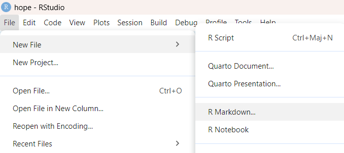
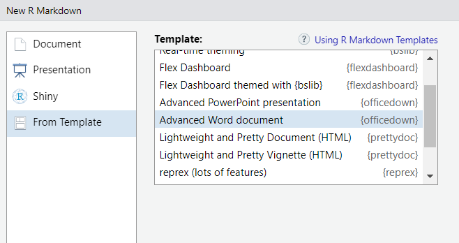
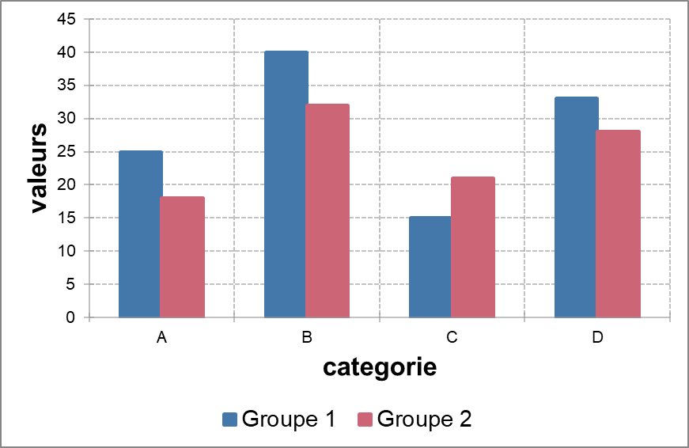
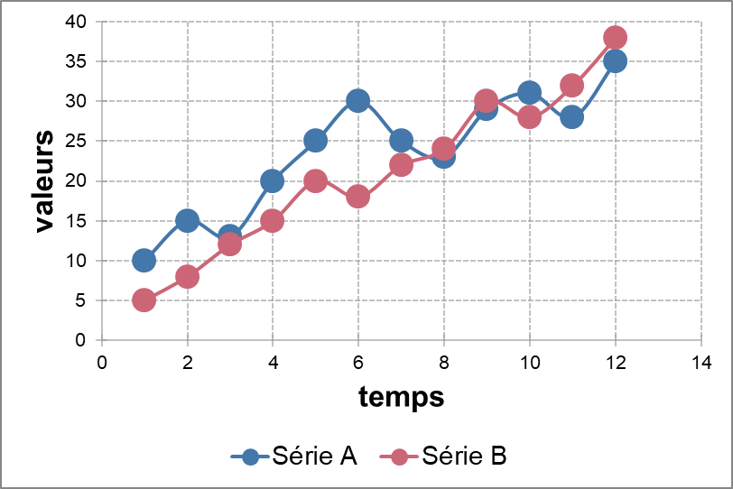
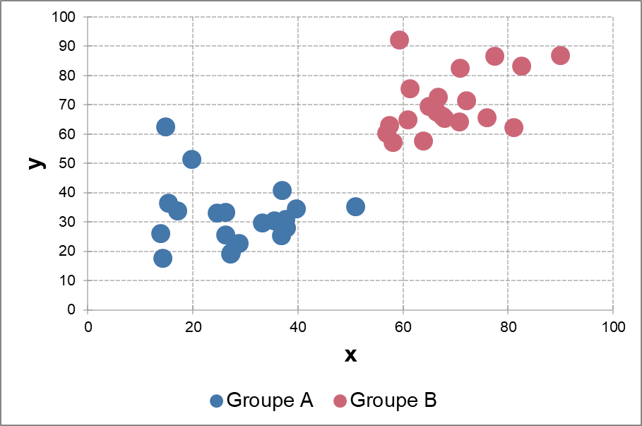
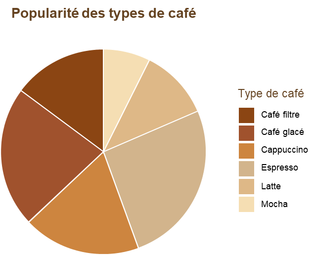

---
output:
  pdf_document:
    latex_engine: xelatex
    keep_tex: true
  html_document:
    df_print: paged
  word_document: default
  toc: true
header-includes:
- \usepackage{hyperref}
- \usepackage{amsmath}
- \usepackage{amssymb}
- \usepackage{graphicx}
- \usepackage{fontspec}
- \usepackage{xcolor}
- \usepackage{tikz}
- \definecolor{blue}{RGB}{0, 0, 100}
- \setmainfont{Times New Roman}
- \setsansfont{Times New Roman}
- \setmonofont{Courier New}
- \usepackage[margin=1in]{geometry}
- \usepackage{titlesec}
- \titleformat{\section}{\Huge\bfseries\color{blue}}{\thesection}{1em}{}
- \titleformat{\subsection}{\huge\bfseries\color{blue}}{\thesubsection}{1em}{}
- \titleformat{\subsubsection}{\LARGE\bfseries\color{blue}}{\thesubsubsection}{1em}{}
- \usepackage{tocloft}
- \renewcommand{\cftsecfont}{\small}
- \renewcommand{\cftsubsecfont}{\footnotesize}
- \renewcommand{\cftsecpagefont}{\small}
- \renewcommand{\cftsubsecpagefont}{\footnotesize}
- \renewcommand{\cftsecleader}{\cftdotfill{\cftdotsep}}
---

\begin{titlepage}
    \begin{center}
    % Début de la bordure avec TikZ
    \begin{tikzpicture}[remember picture, overlay] % overlay = force TikZ à dessiner par-dessus le contenu existant de la page, plutôt que de réserver un espace supplémentaire pour le dessin, remember = lorsque vous voulez dessiner par rapport à la position exacte de la page
    % Définir une couleur élégante
    \definecolor{blue}{RGB}{0, 100, 0}
    
    % Dessiner une bordure élégante avec coins arrondis
    \draw[
        line width=5pt, % Épaisseur du trait
        black, % Couleur de la bordure
        rounded corners=15pt, % Coins arrondis
        double, % Bordure double
        double distance=2pt % Espacement entre les deux lignes
    ] 
        ([xshift=10pt, yshift=-10pt]current page.north west) rectangle
        ([xshift=-10pt, yshift=10pt]current page.south east);
    \end{tikzpicture}
        \includegraphics[width=7cm]{Figures/LOGO1.jpeg} \\[0.1cm]
        \includegraphics[width=6cm]{Figures/LOGO2.jpeg} \\[0.1cm]
        
        \textbf{\large Agence nationale de la Statistique et de la Démographie (ANSD)}\\[0.2cm]
        
        \includegraphics[width=4cm]{Figures/LOGO3.jpeg} \\[0.1cm]
        
        \textbf{\large Ecole nationale de la Statistique et de l'Analyse économique Pierre Ndiaye (ENSAE)}\\[0.4cm]
        
        \textit{\LARGE Semestre 2 : Projet statistique sous R }\\[0.3cm]
        \textbf{\Huge \color{blue} \textsf{Partie 2 : Génération de rapports sur Word avec Rmarkdown}}\\[0.2cm]
        
        \begin{minipage}{0.5\textwidth}
    \begin{flushleft} \large
        \emph{\textsf{Rédigé par :}}\\
        \textbf{Khadidiatou Diakhaté}\\
        \textbf{Haba Fromo Francis}\\
        \textbf{Dior Mbengue}\\
    \end{flushleft}
\end{minipage}
        \hfill
        \begin{minipage}{0.4\textwidth}
            \begin{flushright} \large
                \emph{\textsf{Sous la supervision de :}} \\
                \textbf{M. Aboubacre HEMA}\\
                \textit{Research Analyst }
            \end{flushright}
        \end{minipage}

        \vfill 

        {\large \textsf{Année scolaire : 2024/2025}}\\[0.5cm]
        
    \end{center}
\end{titlepage}

# Introduction

La création de rapports statistiques professionnels nécessite des outils adaptés pour produire des documents structurés, cohérents et visuellement attrayants. RMarkdown s'est imposé comme une solution incontournable pour les statisticiens et data scientists, permettant de combiner du texte explicatif avec du code R exécutable et ses résultats dans un même document.

**Pourquoi utiliser R Markdown pour générer un document Word ?**

-   Automatisation de la rédaction : plus besoin de faire du copier-coller :

-   Séparation contenu / mise en forme : tu te concentres sur le fond, R s’occupe du rendu

-   Intégration directe de tableaux, graphiques, équations, bibliographies

-   Génération de rapports reproductibles, parfaits pour des livrables professionnels

Dans ce qui suit, nous explorons spécifiquement comment produire des documents Word de qualité professionnelle avec RMarkdown. Bien que RMarkdown offre plusieurs formats de sortie (HTML, PDF, etc.), le format Word reste privilégié dans de nombreux contextes professionnels, notamment dans les administrations et les organisations qui utilisent principalement la suite Microsoft Office.

## Les packages officer, officedown, flextable, mschart, rvg

Pour générer un document Word optimal avec RMarkdown, nous avons délibérément choisi d'utiliser le package **officedown** avec le template **Advanced Word Document** pour plusieurs raisons essentielles :

1.  **Contrôle avancé de la mise en forme** : Contrairement au format Word standard de RMarkdown qui offre des options limitées, officedown permet un contrôle précis sur tous les aspects de mise en page (styles, en-têtes, pieds de page, colonnes multiples).

2.  **Intégration avec l'écosystème R** : officedown s'intègre parfaitement avec les packages populaires comme flextable et mschart, offrant ainsi une expérience cohérente pour la présentation des tableaux et graphiques.

3.  **Référencement croisé avancé** : Le template Advanced Word Document facilite la création et la gestion des références croisées entre figures, tableaux et sections.

4.  **Compatibilité Microsoft Office** : Les documents générés sont pleinement compatibles avec les fonctionnalités de Microsoft Word, permettant une édition ultérieure sans perte de formatage.

5.  **Environnement de travail unifié** : Ce template permet aux statisticiens de rester dans l'environnement R tout en produisant des documents qui répondent aux exigences des formats institutionnels.


## Comment accéder au template Advanced Word Document ?

Pour accéder au template officedown et profiter de toutes ses fonctionnalités, nous procédons comme suit :

1.  Dans RStudio, cliquez sur **File** \> **New File** \> **R Markdown**

{width="449"}

2.  Dans la boîte de dialogue qui s'ouvre, sélectionnez l'onglet **From Template**, puis choisissez **Advanced Word document**

{width="449"}

Cette sélection nous donne accès à un template enrichi spécifiquement conçu pour la génération de documents Word professionnels. Explorons maintenant comment l'utiliser efficacement et découvrons les fonctionnalités avancées qu'il propose.

# I. Le YAML (Yet Another Markup Language)

Le YAML constitue l'en-tête du document RMarkdown et joue un rôle crucial dans la configuration du document. Pour un document officedown, la structure du YAML est particulièrement importante car elle détermine comment le document sera transformé en format Word.

## Structure de base du YAML pour officedown

``` yaml
---
# --- MÉTADONNÉES DU DOCUMENT ---
date: "`r Sys.Date()`"
author: "Votre Nom"
title: "Titre du document"

# --- FORMAT DE SORTIE ---

output: 
  officedown::rdocx_document:        # Format de sortie Word via officedown
    reference_docx: "template.docx"  # Optionnel : utiliser un modèle Word existant
    mapstyles:                       # Permet d’associer des styles R Markdown à des styles Word
      Normal: ['First Paragraph']    # Le style "Normal" de R Markdown utilisera le style Word "First Paragraph"
    toc: true                         # Table des matières
    toc_depth: 3                      # Profondeur de la table des matières
    page_size:                        # Taille et orientation de la page
      width: 8.5
      height: 11
      orient: "portrait"
    page_margins:                     # Marges personnalisées du document
      bottom: 1                       # Marge bas (pouces)
      top: 1                          # Marge haut
      right: 1                        # Marge droite
      left: 1                         # Marge gauche
      header: 0.5                     # Distance de l’en-tête par rapport au haut de page
      footer: 0.5                     # Distance du pied de page
      number_sections: true             # Active la numérotation automatique des titres (1., 1.1., etc.)

    fontsize: 11pt                    # Taille de police globale (texte normal du document)
---
```

## Avantages du YAML officedown par rapport au YAML standard

La configuration YAML d'officedown offre plusieurs avantages significatifs par rapport au YAML standard de RMarkdown pour Word :

1.  **Contrôle précis de la mise en page** : Les options `page_size` et `page_margins` permettent de définir exactement la taille et les marges du document.

2.  **Mappage de styles** : L'option `mapstyles` permet d'associer les styles RMarkdown aux styles Word existants, garantissant une cohérence visuelle.

3.  **Intégration avec les templates existants** : L'option `reference_docx` permet d'utiliser un modèle Word existant, facilitant l'adoption des chartes graphiques institutionnelles.

4.  **Personnalisation avancée** : Des options supplémentaires comme `toc_depth` offrent un contrôle plus fin sur des éléments spécifiques du document.

Cette structure avancée du YAML constitue l'un des principaux avantages du template Advanced Word Document par rapport aux templates standards de RMarkdown.

# II. Le chunk de configuration

Le chunk de configuration est essentiel pour définir les paramètres globaux du document et importer les packages nécessaires. Voici une configuration complète et optimisée :

```{r setup}
knitr::opts_chunk$set(
	echo = TRUE,
	fig.cap = TRUE,
	fig.height = 5,
	fig.width = 8,
	message = FALSE,
	warning = FALSE,
	comment = FALSE,
	dpi = 300
)
# Importation des packages essentiels
library(officedown)      # Package principal pour Word avancé
library(officer)         # Manipulation de documents Office
library(flextable)       # Tableaux avancés
library(mschart)         # Graphiques Office
library(rvg)             # Graphiques vectoriels
library(gtsummary)       # Pour les tableaux de statistiques descriptives
library(dplyr)           # Manipulation de données
library(ggplot2)         # Visualisation de données
library(knitr)           # Intégration R et Markdown


# Importation et préparation des bases de données pour les exemples
data("mtcars")
```

Cette configuration complète garantit que tous les éléments nécessaires sont chargés et que les paramètres de base sont définis pour l'ensemble du document. Les styles définis pourront être réutilisés tout au long du document pour maintenir une cohérence visuelle.

# III. Structuration avancée du document

La structuration avancée du document est l'un des points forts d'officedown, offrant des possibilités qui vont bien au-delà des capacités standard de RMarkdown.

## 1. Les sections multicolonnes

Les sections multicolonnes sont particulièrement utiles pour présenter des informations en parallèle ou pour optimiser l'utilisation de l'espace sur la page.

Pour créer une section à deux colonnes, la syntaxe est la suivante :

``` text
<!---BLOCK_MULTICOL_START:cols=2;space=20;sep=true;equalwidth=false--->

Mettre le premier bloc de texte ici

r run_columnbreak()

Mettre le deuxième bloc de texte ici

<!---BLOCK_MULTICOL_STOP{widths: [1.5,1], space: 0.3, sep: true}--->
```

Cette fonctionnalité est particulièrement utile pour les comparaisons, les listes parallèles ou pour présenter des informations complémentaires côte à côte.

**Paramètres personnalisables :**

-   `cols` : Nombre de colonnes (2, 3, etc.)
-   `space` : Espace entre les colonnes (en points)
-   `sep` : Présence d'une ligne de séparation entre les colonnes
-   `equalwidth` : Colonnes de largeur égale ou proportionnelle au contenu
-   `widths` : Définition manuelle de la largeur relative des colonnes

## 2. Les sections en orientation paysage

L'orientation paysage est idéale pour les tableaux ou graphiques larges qui ne tiendraient pas confortablement dans une page en orientation portrait.

La syntaxe est simple :

``` text
<!---BLOCK_LANDSCAPE_START--->

Contenu en format paysage (tableaux larges, grands graphiques, etc.)

<!---BLOCK_LANDSCAPE_STOP--->
```

Cette fonctionnalité résout élégamment le problème des tableaux ou graphiques trop larges pour le format portrait standard, sans avoir à redimensionner le contenu ou à compromettre sa lisibilité.

## 3. Les sections de page personnalisées

Officedown permet également de définir des sections de page avec des caractéristiques spécifiques :

``` text
<!---BLOCK_SECTION_CONTINUOUS--->
Nouvelle section sans saut de page
<!---BLOCK_SECTION_NEXT_PAGE--->
Nouvelle section commençant sur une nouvelle page
<!---BLOCK_SECTION_EVEN_PAGE--->
Nouvelle section commençant sur une page paire
<!---BLOCK_SECTION_ODD_PAGE--->
Nouvelle section commençant sur une page impaire
```

Elles permettent de **créer des sauts de section Word** (pas juste des sauts de page), ce qui est essentiel quand on veut :

-   changer l’**orientation** (portrait ↔ paysage),

-   utiliser des **marges ou colonnes différentes**,

-   ou simplement **repartir proprement** sur une nouvelle partie.

# IV. Création de tableaux avec flextable

Le package flextable permet de créer des tableaux sophistiqués parfaitement intégrés dans des documents Word. Contrairement aux tableaux générés par les fonctions standard de R, les tableaux flextable conservent leur formatage et peuvent être modifiés directement dans Word après génération.


Flextable fonctionne selon un principe de "pipe" où l'on enchaîne des fonctions de mise en forme sur un tableau de base :

```{r tab.cap="Tableau avec Flextable"}
# Création d'un jeu de données d'exemple
quarterly_data <- data.frame(
  Region = c("Nord", "Sud", "Est", "Ouest", "Centre"),
  T1_2024 = c(254, 187, 325, 198, 231),
  T2_2024 = c(278, 203, 341, 212, 245),
  T3_2024 = c(301, 225, 352, 235, 260),
  T4_2024 = c(315, 242, 368, 253, 274)
)

# Création d'un tableau flextable élaboré
flextable(quarterly_data) %>%
  # Application de thème
  theme_booktabs() %>%
  # Personnalisation des en-têtes
  bg(bg = "#4472C4", part = "header") %>%
  color(color = "white", part = "header") %>%
  bold(part = "header") %>%
  # Formatage conditionnel des données
  bg(j = 3, bg = function(x) {
    ifelse(x > 300, "#C6E0B4", "#FFFFFF")
  }) %>%
  bg(j = 5, bg = function(x) {
    ifelse(x > 300, "#C6E0B4", "#FFFFFF")
  }) %>%
  # Formatage de la première colonne (régions)
  bold(j = 1) %>%
  # Ajout d'une ligne de total
  
  # Formatage de la ligne de total
  bold(part = "footer") %>%
  bg(bg = "#D9E1F2", part = "footer") %>%
  # Bordures
  hline_top(border = fp_border(color = "#4472C4", width = 2), part = "header") %>%
  hline_bottom(border = fp_border(color = "#4472C4", width = 1), part = "header") %>%
  hline_bottom(border = fp_border(color = "#4472C4", width = 2), part = "body") %>%
  # Ajustement et autres paramètres
  align(align = "center", part = "all") %>%
  valign(valign = "center", part = "all") %>%
  padding(padding = 4, part = "all") %>%
  fontsize(size = 10, part = "all") %>%
  set_caption("Évolution des ventes trimestrielles par région (en milliers d'euros)") %>%
  autofit()
```


# V. Quelques types de graphiques plus adaptés à Word

L'intégration de graphiques professionnels dans les documents Word est un autre point fort de l'approche officedown, avec deux options principales : les graphiques mschart et les graphiques ggplot2 via rvg.

## 1. Les graphiques mschart

mschart permet aux utilisateurs de R de créer des graphiques Microsoft Office (graphiques modifiables dans Word ou PowerPoint) à partir de données R.

Ces graphiques :

-   sont modifiables directement dans Word ou PowerPoint (titre, données, couleurs…)

-   contiennent les données source, ce qui permet de les mettre à jour côté Microsoft

Ce n’est pas un équivalent de ggplot2. mschart permet uniquement un sous-ensemble de graphiques Microsoft.

Les types de graphiques disponibles sont les suivants : - Diagrammes en barres → ms_barchart()

-   Courbes → ms_linechart()

-   Nuages de points → ms_scatterchart()

-   Aires → ms_areachart()

Pour contrôler l’apparence complète du graphique (axes, couleurs, styles, tailles, texte, thème…), peut voir toutes les fonctions à intégrer avec la commande R `help("mschart")`.

Cependant, on ne peut pas directement insérer un mschart à travers Rmarkdown. Sa génération renvoie directement un document Word où il est créé.
   
-   Par exemple, ce code, exécuté dans un script R :

```{r eval=FALSE, fig.cap="Évolution des ventes mensuelles par catégorie de produit"}
library(mschart)
library(officer)
library(dplyr)

# Créer un nouveau document Word
doc <- read_docx()


# ------------------------------------------------------------------------
# MS_BARCHART - Graphique à barres groupés
# ------------------------------------------------------------------------
doc <- body_add_par(doc, "Graphique à barres (ms_barchart)", style = "heading 1")

# Ajouter le header pour le graphique
doc <- body_add_par(doc, " Graphique à barres groupées (ms_barchart)", style = "heading 1")
# Graphique à barres groupées
donnees_barres_groupees <- data.frame(
  categorie = rep(c("A", "B", "C", "D"), each = 2),
  groupe = rep(c("Groupe 1", "Groupe 2"), times = 4),
  valeurs = c(25, 18, 40, 32, 15, 21, 33, 28)
)
# Le graphique
chart_barres_groupees <- ms_barchart(
  data = donnees_barres_groupees,
  x = "categorie",
  y = "valeurs",
  group = "groupe"
)

doc <- body_add_chart(doc, chart = chart_barres_groupees)

# ------------------------------------------------------------------------
# MS_LINECHART - Graphique en lignes
# ------------------------------------------------------------------------
doc <- body_add_break(doc)
doc <- body_add_par(doc, "Graphique en lignes multipl (ms_linechart)", style = "heading 1")

# Graphique en lignes multiples
donnees_lignes_multi <- data.frame(
  temps = rep(1:12, 2),
  serie = rep(c("Série A", "Série B"), each = 12),
  valeurs = c(
    10, 15, 13, 20, 25, 30, 25, 23, 29, 31, 28, 35,
    5, 8, 12, 15, 20, 18, 22, 24, 30, 28, 32, 38
  )
)

chart_lignes_multi <- ms_linechart(
  data = donnees_lignes_multi,
  x = "temps",
  y = "valeurs",
  group = "serie"
)


doc <- body_add_chart(doc, chart = chart_lignes_multi)


# ------------------------------------------------------------------------
# MS_SCATTERCHART - Graphique en nuage de points avec groupes
# ------------------------------------------------------------------------
doc <- body_add_break(doc)
# Ajouter le graphique au document
doc <- body_add_par(doc, "Graphique en nuage de points avec groupes (ms_scatterchart)", style = "heading 1")

# Nuage de points avec groupes
donnees_scatter_groupe <- rbind(
  data.frame(x = rnorm(20, mean = 30, sd = 10), 
             y = rnorm(20, mean = 30, sd = 10), 
             groupe = "Groupe A"),
  data.frame(x = rnorm(20, mean = 70, sd = 10), 
             y = rnorm(20, mean = 70, sd = 10), 
             groupe = "Groupe B")
)

chart_scatter_groupe <- ms_scatterchart(
  data = donnees_scatter_groupe,
  x = "x",
  y = "y",
  group = "groupe"
)


doc <- body_add_chart(doc, chart = chart_scatter_groupe)


# ------------------------------------------------------------------------
# Enregistrer le document Word
# ------------------------------------------------------------------------
print(doc, target = "exemples_graphiques_mschart.docx")

```

-   On a les graphiques suivants qui sont directement éditables dans Word







## 2. Faire des graphiques éditables avec rvg

Le package **`rvg`** est un outil très utile lorsqu’on souhaite **transformer des graphiques R en objets modifiables directement dans PowerPoint**.

Plus précisément, il permet de **convertir des graphiques créés avec `ggplot2` ou la base R (`plot()`) en objets vectoriels**, appelés *DrawingML*, qui peuvent être **édités directement dans PowerPoint**. Cela signifie que l'on peut **changer les couleurs, les titres, les polices ou même supprimer des éléments**, sans avoir à retourner dans R.

Toutefois, cette fonctionnalité n’est **possible que pour les sorties PowerPoint (`.pptx`)**, et **pas directement pour Word**. C’est une limite du format `.docx` qui ne gère pas les objets vectoriels de la même façon.

**Mais il existe une astuce** : on peut générer les graphiques avec `rvg` dans un document PowerPoint, puis **les copier-coller dans Word**. Cela demande un peu de gymnastique, mais **le résultat en vaut la peine**

```{r fig-pie-coffee, eval=FALSE, fig.cap="Figure : Répartition de la popularité des types de café", results='asis'}
library(ggplot2)

# Données d'exemple
coffee_preferences <- data.frame(
  type = c("Espresso", "Cappuccino", "Café filtre", "Latte", "Mocha", "Café glacé"),
  popularite = c(35, 25, 20, 15, 10, 30)
)

# Graphique circulaire
plot <- ggplot(coffee_preferences, aes(x = "", y = popularite, fill = type)) +
  geom_bar(stat = "identity", width = 1, color = "white") +
  coord_polar("y", start = 0) +
  theme_void() +
  labs(
    fill = "Type de café",
    title = "Popularité des types de café"
  ) +
  scale_fill_manual(values = c("#8B4513", "#A0522D", "#CD853F", "#D2B48C", "#DEB887", "#F5DEB3")) +
  theme(
    plot.title = element_text(hjust = 0.5, color = "#654321", face = "bold"),
    legend.title = element_text(color = "#654321")
  )
rvg::dml(ggobj = plot) # pour le transformer en graphique éditable
```



## 3. Comparaison et cas d'utilisation

Les deux approches ont leurs avantages :

**Avantages de mschart :**

-   Graphiques modifiables directement dans Word
-   Contient les données sources (mise à jour possible)
-   Intégration parfaite avec l'esthétique Office
-   Idéal pour les documents destinés à la modification
-   Interface familière pour les utilisateurs Office

**Avantages de ggplot2 avec rvg :**

-   Personnalisation extrêmement poussée
-   Grande variété de types de graphiques
-   Contrôle précis de tous les éléments visuels

Le choix entre ces deux approches dépend principalement de l'utilisation prévue du document final et des besoins de personnalisation.

\newpage

# VI. Navigation et référencement dans le document

Un document professionnel nécessite des éléments de navigation efficaces. Officedown nous donne des solutions assez pratiques à cet effet.

## 1. Table des matières personnalisée

La table des matières peut être insérée précisément où vous le souhaitez avec un contrôle sur sa profondeur :

``` text
<!---BLOCK_TOC:depth=3--->
```

Cette instruction permet d'insérer une table des matières qui inclura les titres jusqu'au niveau 3 (chapitres, sections, et sous-sections).

## 2. Liste des figures

Pour insérer la liste des graphiques, on écrit la commande suivante :

``` text
<!---BLOCK_TOC{seq_id: 'fig'}--->

```
Il suffit juste d'ajouter dans les infos concernant le chunk, `fig.cap= "Nom du tableau"` comme dans l'exemple suivant : 

``` text
```{r fig-trends, eval=FALSE, fig.cap="Évolution de la consommation mondiale de café et des prix (2013-2023)"}
Mettre ici le code pour le graphique
```
```

## 3. Liste des tableaux

Pour générer la liste des tableaux, il ne suffit pas de mettre `tab.cap`, il faut définir le caption du graphique directement avec le package choisi pour tracer le graphique.
- Pour le package flextable, il faut utiliser la fonction `set_caption()` avec les paramètres `caption` et `autonum` comme dans l'exemple suivant : 

```{r tab:flextable-exemple, eval=FALSE}
library(flextable)

donnees <- data.frame(
  Variable = c("Age", "Taille", "Poids"),
  Moyenne = c(34.2, 172.5, 68.7),
  Ecart_type = c(8.4, 10.2, 12.3)
)

# flextable utilise set_caption() pour définir la légende
flextable(donnees) %>%
  set_caption(
    caption = "Consommation, production et échanges de café par pays (kg par habitant)",
    autonum = run_autonum(seq_id = "tab", bkm = "tab_produits") # Pour la numérotation automatique et le signet
  )) %>%
  theme_booktabs() %>%
  autofit()
```

-   Pour le package `gtsummary()`, c'est la fonction `modify_caption()`
Cette instruction insère une liste de tous les tableaux du document. 

``` text
<!---BLOCK_TOC{seq_id: 'tab'}--->
```

Cette instruction insère une liste de tous les tableaux du document.


## 4. Signets et hyperliens

officedown permet également de créer des signets et des hyperliens internes :

### Création d’un signet dans un titre

``` text
Introduction à la méthodologie {#section_methodo}
```

Cela génère automatiquement un **signet Word** appelé `section_methodo`.

### Faire un lien vers ce signet

``` text
Pour plus de détails, voir la [section méthodologie](#section_methodo).
```

Ce lien fonctionne comme un **hyperlien interne** dans le document Word final.


# VII. Notes de bas de page


Les notes de bas de page sont essentielles pour fournir des informations supplémentaires sans perturber le flux principal du texte. En RMarkdown avec officedown, elles sont faciles à implémenter :

-   La syntaxe est la suivante :

``` text
L'analyse a révélé une corrélation significative entre les variables[^1].

[^1]: Le seuil de significativité a été fixé à p \< 0,05 pour toutes les analyses.
```

-   Le résultat est le suivant :

L'analyse statistique a révélé une corrélation significative[^1].

[^1]: Le seuil de significativité a été fixé à p \< 0,05 pour toutes les analyses.

Ces notes de bas de page sont automatiquement numérotées et formatées selon les conventions typographiques standards.

\newpage

# VIII. Utilisation de templates Word existants

Pour une intégration parfaite avec les normes institutionnelles, il est souvent judicieux d'utiliser un template Word existant.

Les étapes à suivre sont les suivantes

1.  Creer un template Word s'il n'existe pas déjà

2.  L'utiliser dans le R markdown en insérant dans le YAML avec reference_docx comme ceci :

``` yaml
output: 
  officedown::rdocx_document:
    reference_docx: "template_word.docx"
```

Cette approche permet d'hériter de tous les styles, en-têtes, pieds de page et autres éléments de mise en page prédéfinis dans le template.

## Comment les styles RMarkdown se lient aux styles Word

| Élément RMarkdown           | Style Word attendu |
|-----------------------------|--------------------|
| `# Mon titre`               | Heading 1          |
| `## Sous-titre`             | Heading 2          |
| Texte normal                | Normal             |
| Tableaux `flextable`        | Table              |
| Graphiques `ggplot` (`rvg`) | Figure             |
| Titre du document           | Title              |

Si ces styles sont bien définis dans le modèle Word, le rendu final sera parfaitement formaté.

## Qu'est ce que le document va hériter du template

| Élément hérité | Description |
|----------------------------|--------------------------------------------|
| **Styles de paragraphe** (`Normal`, `Heading 1`, etc.) | Le texte, les titres, les sous-titres, les légendes suivront les styles Word définis dans le template |
| **Police** (type, taille) | Par défaut, la police du texte, des titres, des tableaux est celle du modèle Word |
| **Couleurs du texte et des titres** | Si tes titres ou paragraphes ont une couleur dans le template, ton document les utilisera |
| **Interligne et espacement** | Gérés dans les styles Word → ton R Markdown va s’adapter automatiquement |
| **Mise en page globale** (marges, orientation) | Le document respecte les marges, en-têtes et pieds de page du modèle |
| **Styles de tableaux** (`Table`) | Les tableaux générés avec `flextable` peuvent utiliser les styles Word définis (bordures, couleurs…) |
| **Style d’image ou de légende** (`Figure`) | Les images et graphiques peuvent hériter d’un style spécifique défini dans Word |
| **En-têtes et pieds de page** | Logo, date, pagination : tout ce qui est dans l’en-tête/pied du modèle est repris |


# Conclusion

## Avantages de l'approche officedown

L'utilisation de RMarkdown avec le package officedown pour la génération de rapports Word présente plusieurs avantages significatifs :

1.  **Reproductibilité analytique** : Le code R et son résultat sont liés, garantissant que les tableaux et graphiques correspondent aux analyses effectuées.

2.  **Efficacité et gain de temps** : Les modifications des données ou des analyses sont propagées automatiquement dans l'ensemble du document, éliminant le besoin de mettre à jour manuellement les résultats.

3.  **Cohérence visuelle** : Les styles définis peuvent être réutilisés systématiquement, assurant une présentation cohérente tout au long du document.

4.  **Flexibilité de format** : Un même document source peut générer différents formats de sortie (Word, PDF, HTML) selon les besoins.

5.  **Contrôle avancé** : officedown offre un niveau de contrôle sur la mise en page et la structure du document qui dépasse les capacités de RMarkdown standard.

## Limites et solutions alternatives

Malgré ses nombreux avantages, cette approche présente quelques limitations :

1.  **Courbe d'apprentissage** : La maîtrise de RMarkdown, officedown et des packages associés nécessite un investissement initial en temps et en formation.

2.  **Éléments extérieurs au contenu** : Certains éléments comme les en-têtes et pieds de page complexes restent plus faciles à gérer directement dans Word.

3.  **Contrôle pixel-parfait** : Pour des mises en page très spécifiques, l'édition directe dans Word après génération peut rester nécessaire.
